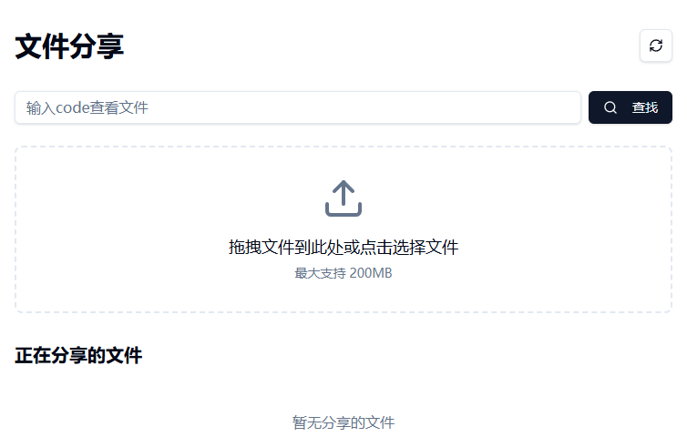

# 文件分享服务

一个简单的前后端分离文件分享服务，支持文件分享和实时传输助手功能。

## 技术栈

- **前端**: React 19 + TypeScript + Vite 7 + Tailwind CSS 4 + shadcn/ui
- **后端**: Node.js + Express
- **实时通信**: WebSocket

## 功能特点

### 文件分享

- 拖拽或点击上传文件（最大 200MB）
- 自动生成6位随机code作为分享标识
- 支持设置过期时间（10分钟/30分钟/1小时/3小时/无限制）
- 支持设置下载次数限制（1次/3次/5次/10次/无限制）
- 文件自动过期删除
- 二维码分享
- 上传进度和速度显示
- 图片预览
- 文本文件预览（支持代码高亮）
- 直接创建文本内容分享（无需单独上传txt文件）
- 中文文件名支持

### 传输助手

- 创建/加入传输房间
- 实时消息收发（支持 Markdown、LaTeX、Emoji）
- 文件传输（图片、文档等）
- 在线用户列表
- 房间自动关闭（无人时60秒后关闭）
- 移动端适配
- vConsole 调试支持

## 快速开始

### 1. 安装依赖

```bash
# 安装后端依赖
cd server
npm install

# 安装前端依赖
cd ../client
npm install
```

### 2. 启动服务

```bash
# 终端1 - 启动后端
cd server
npm run dev

# 终端2 - 启动前端
cd client
npm run dev
```

### 3. 访问应用

- 前端地址: http://localhost:5173
- 后端地址: http://localhost:8989

## API 接口

### 文件分享

| 方法 | 路径 | 描述 |
|------|------|------|
| POST | /api/upload | 上传文件 |
| POST | /api/text | 创建文本文件 |
| GET | /api/files | 获取文件列表 |
| GET | /api/file/:code | 获取文件信息 |
| GET | /api/text/:code | 获取文本文件内容 |
| PUT | /api/file/:code | 更新文件设置 |
| DELETE | /api/file/:code | 删除文件 |
| GET | /api/download/:code | 下载文件 |

### 传输助手

| 方法 | 路径 | 描述 |
|------|------|------|
| POST | /api/transfer/session | 创建房间 |
| GET | /api/transfer/sessions | 获取活跃房间列表 |
| GET | /api/transfer/session/:id | 获取房间详情 |
| POST | /api/transfer/session/:id/join | 加入房间 |
| POST | /api/transfer/session/:id/leave | 离开房间 |
| POST | /api/transfer/session/:id/message | 发送消息 |
| POST | /api/transfer/session/:id/upload | 上传文件到房间 |

## 目录结构

```
file-share/
├── server/                 # 后端代码
│   ├── index.js           # Express 服务器
│   ├── package.json
│   └── uploads/           # 上传文件存储目录
├── client/                # 前端代码
│   ├── src/
│   │   ├── components/    # React 组件
│   │   │   ├── transfer/  # 传输助手组件
│   │   │   └── ui/        # UI 组件（shadcn/ui）
│   │   ├── pages/         # 页面组件
│   │   │   ├── FileListPage.tsx      # 文件列表页
│   │   │   ├── FileInfoPage.tsx      # 文件详情页
│   │   │   ├── TransferPage.tsx      # 传输助手首页
│   │   │   └── TransferRoomPage.tsx  # 传输房间页
│   │   ├── lib/           # 工具函数和API
│   │   └── main.tsx       # 入口文件
│   ├── vite.config.ts     # Vite 配置（含代理）
│   └── package.json
└── Dockerfile              # Dockerfile
```

## docker compose

```yaml
services:
  file-share:
    image: slk1133/file-share:latest
    container_name: file-share
    ports:
      - 23001:8989
    restart: always
```

## Preview
